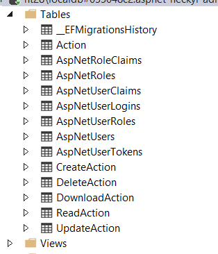

## Claims structure in token for CLIENT

```js
{
	'create':['user','goals','reports'],
	'read':['user','goals','reports'],
	'update':['user','goals','reports'],
	'delete':['user','goals','reports'],
	'download':['user','goals','reports'],	
}
```

## Tables 



### Table structure of AspNet Users, Roles, Actions and related mappings

```cs
public class ApplicationRole:IdentityRole
{
    public ICollection<CreateAction> CreateActions { get; set; }
    public ICollection<ReadAction> ReadActions { get; set; }
    public ICollection<UpdateAction> UpdateActions { get; set; }
    public ICollection<DeleteAction> DeleteActions { get; set; }
    public ICollection<DownloadAction> DownloadActions { get; set; }
}

public class Action
{
    public long Id { get; set; }
    public string Name { get; set; }

    public ICollection<CreateAction> CreateActions { get; set; }
    public ICollection<ReadAction> ReadActions { get; set; }
    public ICollection<UpdateAction> UpdateActions { get; set; }
    public ICollection<DeleteAction> DeleteActions { get; set; }
    public ICollection<DownloadAction> DownloadActions { get; set; }
}

public class ApplicationDbContext : IdentityDbContext<ApplicationUser, ApplicationRole, string>
{
	...

	protected override void OnModelCreating(ModelBuilder builder)
	{
		base.OnModelCreating(builder);
		// Customize the ASP.NET Identity model and override the defaults if needed.
		// For example, you can rename the ASP.NET Identity table names and more.
		// Add your customizations after calling base.OnModelCreating(builder);

		builder.Entity<CreateAction>()
			.HasKey(c => new { c.ApplicationRoleId, c.ActionId });

		builder.Entity<CreateAction>()
			.HasOne(c=>c.Action)
			.WithMany(c=>c.CreateActions)
			.HasForeignKey(c=>c.ActionId);

		builder.Entity<CreateAction>()
			.HasOne(c => c.ApplicationRole)
			.WithMany(c => c.CreateActions)
			.HasForeignKey(c => c.ApplicationRoleId);

		builder.Entity<ReadAction>()
			.HasKey(c => new { c.ApplicationRoleId, c.ActionId });

		builder.Entity<ReadAction>()
			.HasOne(c => c.Action)
			.WithMany(c => c.ReadActions)
			.HasForeignKey(c => c.ActionId);

		builder.Entity<ReadAction>()
			.HasOne(c => c.ApplicationRole)
			.WithMany(c => c.ReadActions)
			.HasForeignKey(c => c.ApplicationRoleId);

		...
	}
}

```


## Claims passed based on roles in IDENTITY SERVER
```cs
 public class IdentityWithAdditionalClaimsProfileService : IProfileService
{
        ...

        public async Task GetProfileDataAsync(ProfileDataRequestContext context)
        {

        	....

			var claims = principal.Claims.ToList();

			user.Role.CreateActions
					.Select(r=>r.Action.Name)
					.ForEach(c=> claims.Add(new Claim("create", c)));

			user.Role.ReadActions
					.Select(r=>r.Action.Name)
					.ForEach(c=> claims.Add(new Claim("read", c)));

			user.Role.UpdateActions
					.Select(r=>r.Action.Name)
					.ForEach(c=> claims.Add(new Claim("update", c)));

			...
		}
}
```

## Claims used at API LAYER using policy based authoriaztion and token passed


### Startup.cs

```cs
services.AddAuthorization(options=>
{
  options.AddPolicy("CreateUser", policy =>
  {
    policy.RequireAuthenticatedUser();
    policy.RequireClaim("create", "user");
  });

  options.AddPolicy("ReadUser", policy =>
  {
    policy.RequireAuthenticatedUser();
    policy.RequireClaim("read", "user");
  });
}
```
### Authoriztion at api controllers

```cs
[Authorize(Policy = "ReadUser")]
public IActionResult ReadUser(Article article)
{
  // ...
}
```

